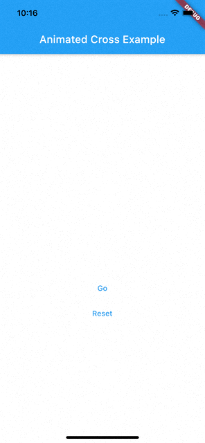

# animated_cross

 

AnimatedCross is a Flutter package with a simple implementation of an animated cross icon.

## Installation

   Add this to your pubspec.yaml:
    
    dependencies:
        animated_cross: ^1.0.0

## Usage

### Import

    import 'package:animated_cross/animated_cross.dart';

### Simple Implementation

    AnimationController(vsync: this, duration: Duration(seconds: 1));
    Animation _animation = new Tween<double>(begin: 0, end: 1)
      .animate(new CurvedAnimation(
        parent: _animationController, 
        curve: Curves.easeInOutCirc)
      );

    void _showCross() {
      _animation.forward();
    }

    void _resetCross() {
      _animation.reverse();
    }

    AnimatedCross(
      progress: _animation,
      size: 200,
    )

## Contributions

All contributions are welcome!